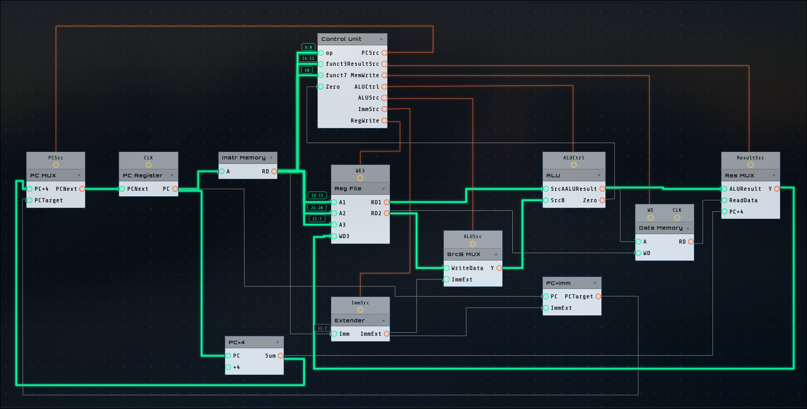
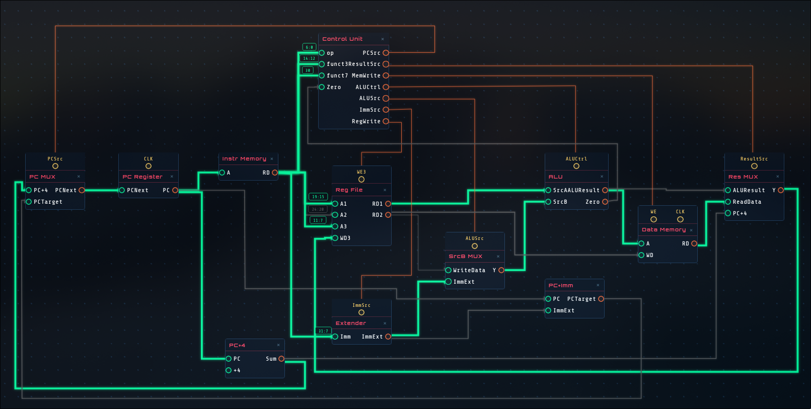
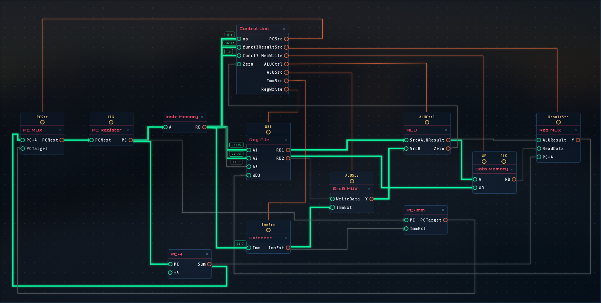
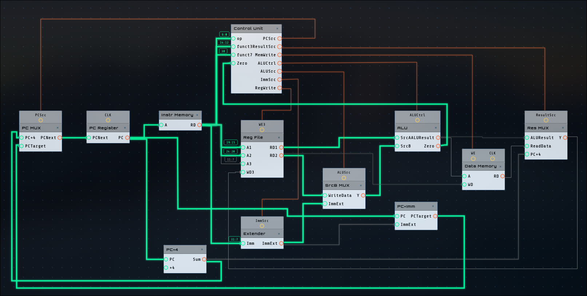
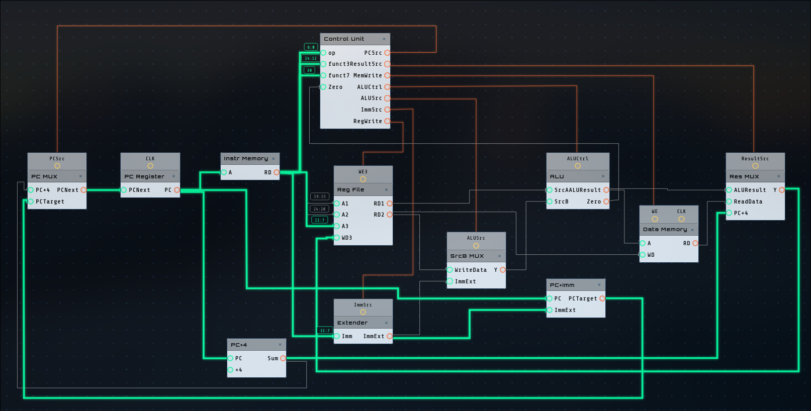

# Single-Cycle RISC-V Processor (RV32I) 🚀

This repository contains a simple, educational **Single-Cycle RISC-V (RV32I)** processor implemented in SystemVerilog. The architecture is primarily based on the design presented in the *Digital Design and Computer Architecture: RISC-V Edition* by Harris & Harris, but features several custom optimizations and architectural refinements for better synthesis efficiency and future extensibility.

## 🌟 Key Features & Optimizations

- **Full RV32I Base Instruction Set Support:** Capable of executing core R-Type, I-Type, S-Type, B-Type, and J-Type instructions.
- **U-Type Extension Ready:** The Immediate Extender (`ImmSrc`) has been widened from 2-bits to **3-bits**, paving the way for U-Type instructions (e.g., `LUI`, `AUIPC`) seamlessly.
- **Synthesis-Friendly "Don't Cares":** The control unit makes extensive use of `x` (don't cares) for signals that don't affect the current datapath state (e.g., ignoring `ResultSrc` during `sw` or `beq`). This allows logic synthesizers (like Yosys or Vivado) to radically optimize the final combinational logic gates.
- **Port Refactoring:** The `SignExtend` module was optimized to only receive the bits it actually needs (`Instr[31:7]`) rather than mapping the entire 32-bit instruction, reducing unnecessary routing congestion.

## 🏗️ Architecture & Datapath

The processor follows a classic von Neumann-like Harvard abstraction for single-cycle execution (separate Instruction and Data memory interfaces outside the core).

### Datapath Execution Flows

*(Add your Circuit Builder schematics below! Here are the 5 main execution paths you should showcase:)*

#### 1. R-Type Instruction (`add`, `sub`, etc.)
 <!-- Replace with your actual image path -->
*Characteristics: ALUSrc selects Register (`RD2`), ResultSrc selects ALU result, RegWrite is Enabled.*

#### 2. I-Type Instruction (`lw` - Load Word)
 <!-- Replace with your actual image path -->
*Characteristics: Critical Path! ALUSrc selects Immediate, ALU calculates address, ResultSrc selects Data Memory output.*

#### 3. S-Type Instruction (`sw` - Store Word)
 <!-- Replace with your actual image path -->
*Characteristics: MemWrite is Enabled, `RD2` is wired directly to Data Memory `WriteData`, RegWrite is Disabled.*

#### 4. B-Type Instruction (`beq` - Branch if Equal)
 <!-- Replace with your actual image path -->
*Characteristics: Feedback loop engaged! ALU calculates subtraction, `Zero` flag goes to Controller, PCSrc toggles PC MUX to target address.*

#### 5. J-Type Instruction (`jal` - Jump and Link)
 <!-- Replace with your actual image path -->
*Characteristics: Result MUX selects `PC+4` to save the return address in the selected register.*

## 📂 Module Hierarchy

```text
riscvsingle (Top Module)
├── controller
│   ├── maindec (Main Decoder - Opcode based)
│   └── aludec  (ALU Decoder - funct3/funct7 based)
└── datapath
    ├── pc_reg     (Program Counter)
    ├── signextend (Immediate Generator)
    ├── regfile    (32x32-bit Register File)
    └── alu        (Arithmetic Logic Unit)
```

## 🚀 Running the Tests

The project includes a comprehensive SystemVerilog testbench (`riscvsingle_tb.sv`) that verifies instruction execution, register updates, and branching logic. 

**Prerequisites:** [Icarus Verilog](http://iverilog.icarus.com/) (`iverilog`).

To run the testbench and see the output trace:

```bash
# Compile the design and the testbench
iverilog -g2012 -o tb.vvp rtl/*.sv tb/riscvsingle_tb.sv

# Run the simulation
vvp tb.vvp
```

You can view the resulting `wave.vcd` file in GTKWave to analyze all inner signals cycle-by-cycle!

## 📜 Supported Instructions

| Type | Instructions Supported In Core |
|------|-------------------------------|
| **R-Type** | `add`, `sub`, `and`, `or`, `xor`, `slt` |
| **I-Type** | `addi`, `lw` |
| **S-Type** | `sw` |
| **B-Type** | `beq` |
| **J-Type** | `jal` |

---
*🎓 Designed for hardware architecture studies and FPGA exploration.*
